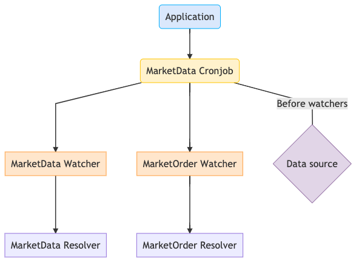

# Trading bot

This is a trading-bot that works alongside **MetaTrader5** , build with typescript and python.

## Design Document

- **Application**: Bootstrap the application.

- **Cronjob**: The entity responsible for running the actions based on a timer, a repassing the data to the **_watchers_**.

- **Watchers**: They are responsible for watching the data a moving them accordingly to the resolvers (if needed), they are also responsible for logging the data (if needed), basically a cronjob can have multiple watchers, and a watcher can have multiple resolvers.

- **Resolvers**: Gather the data from the watchers to act on it, either applying a strategy, storing some data, basically where the action is.

- **Data source**: Source of market data.

---

## Current State

Right now the **trading-bot** is capable of reaching out to MT5, collect the symbol data, store it at SQLite DB and, based on that data, it looks backwards up to an X amount of registers, to decide if an order should be taken to either **buy it** or **sell it**. These actions are being taken based on a `MarketStrategy`, that has a positive factor and a negative factor, on which every action is gonna be based upon.

---

## Backlog

Click [here](https://lucas-fonte.github.io/trading-bot/) for the full html documentation.

---
