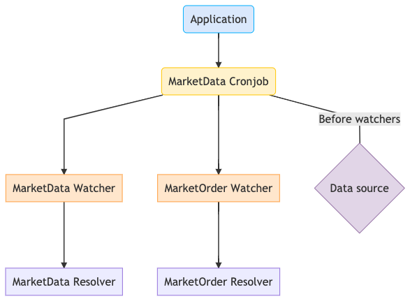

# Trading bot

This is a trading-bot that works alongside **MetaTrader5** , build with typescript and python.

## Design Document

- **Application**: Bootstrap the application.

- **Cronjob**: The entity responsible for running the actions based on a timer, a repassing the data to the **_watchers_**.

- **Watchers**: They are responsible for watching the data a moving them accordingly to the resolvers (if needed), they are also responsible for logging the data (if needed), basically a cronjob can have multiple watchers, and a watcher can have multiple resolvers.

- **Resolvers**: Gather the data from the watchers to act on it, either applying a strategy, storing some data, basically where the action is.

- **Data source**: Source of market data.
