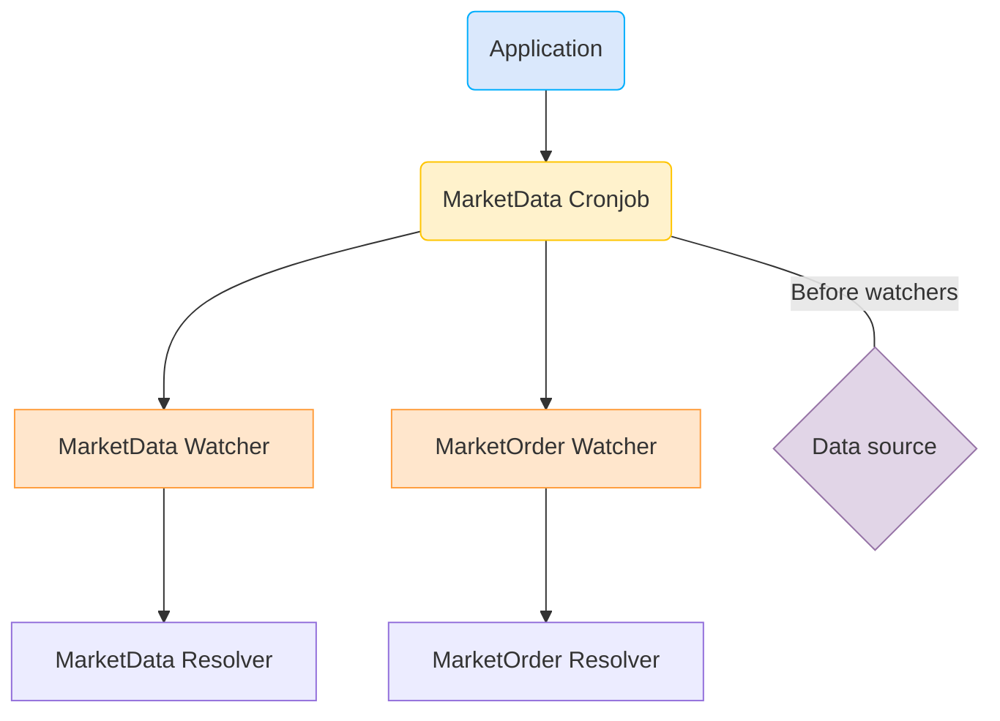

```mermaid
    graph TD
        A(Application) --> B(MarketData Cronjob)
        B(MarketData Cronjob)  --> C[MarketData Watcher]
        B(MarketData Cronjob)  --> D[MarketOrder Watcher]
        B(MarketData Cronjob) --- |Before watchers| E{Data source}
        C[MarketData Watcher] --> F[MarketData Resolver]
        D[MarketOrder Watcher] --> G[MarketOrder Resolver]

        style A fill:#DAE8FC,stroke: #00aefd, stroke-width:1px
        style B fill:#FFF2CC,stroke: #ffc500, stroke-width:1px
        style C fill:#FFE6CC,stroke: #ff9e3e, stroke-width:1px
        style D fill:#FFE6CC,stroke: #ff9e3e, stroke-width:1px
        style E fill:#E1D5E7,stroke: #9673A6, stroke-width:1px

```
